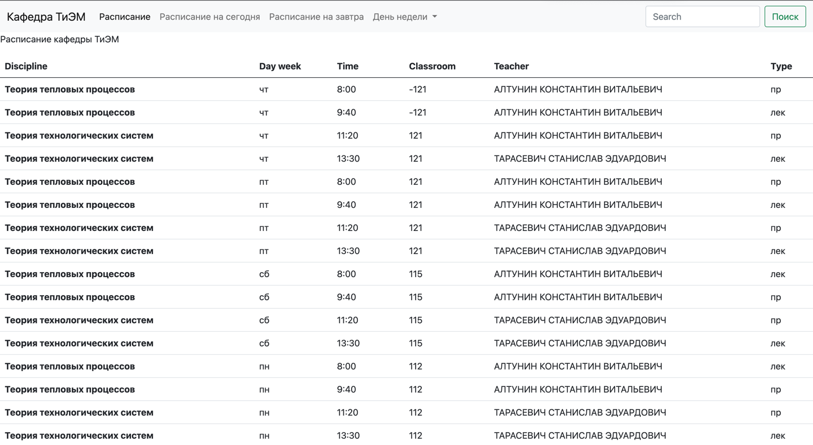
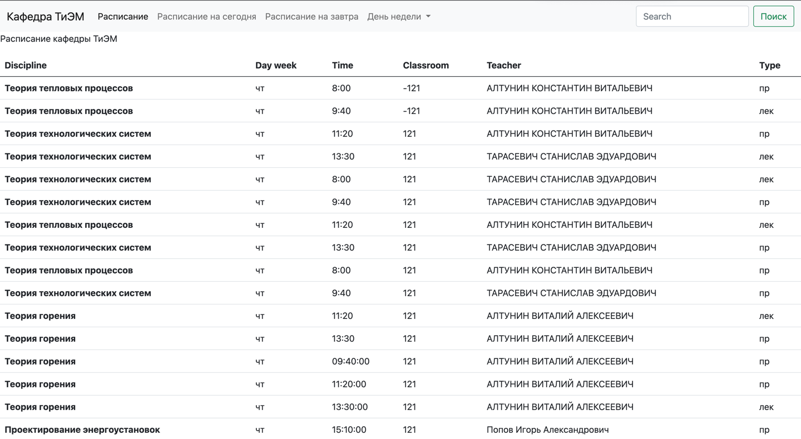
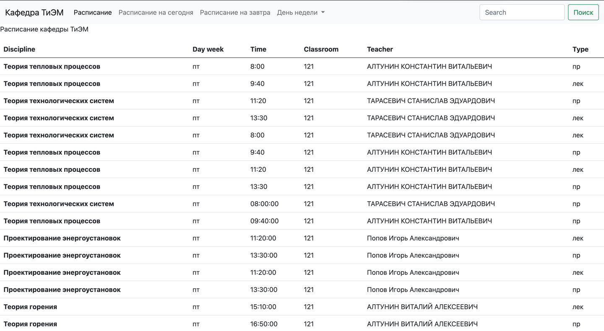
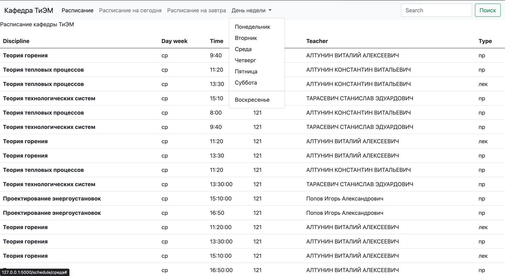
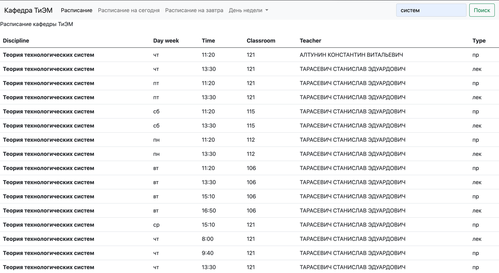
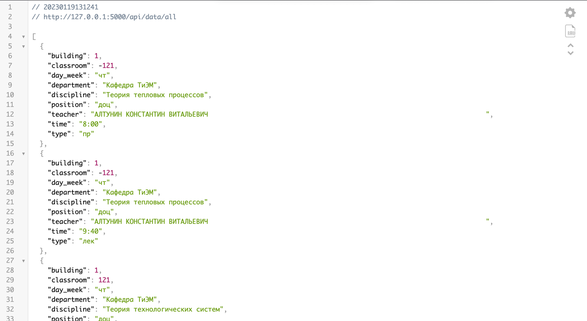
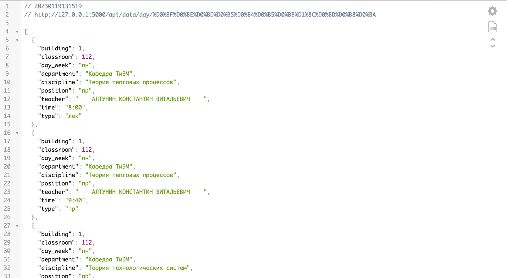
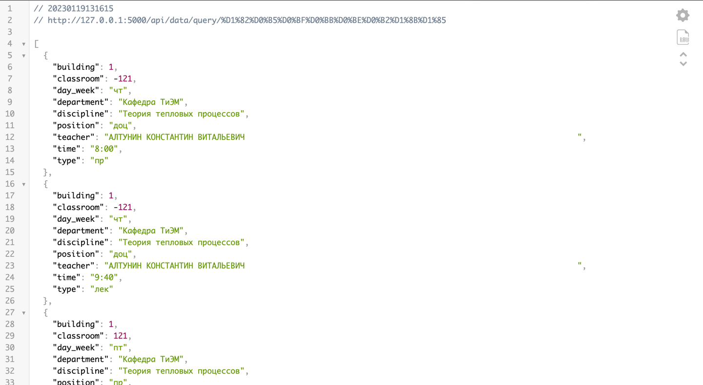

Расписание занятий
=
_Контрольное задание 2_

---
Описание проекта:
-
**Основной задачей проекта было:** написать программу с расписанием для Оли, которая перешла на 3-й курс.

**Было необходимо:**
* Написать программу, которая будет выводить расписание на завтра, чтобы Оля смогла подготовить все свои предметы

**Дополнительно:**
* Должен осуществляться поиск по конкретному предмету, чтобы было видно, в какие дни они проходят

_Время выполнения: 3 часа_

---
Главная страница
-

Расписание на сегодня в реальном времени:
-

Расписание на завтра в реальном времени:
-

Выбор расписания по дню недели:
-

Поиск по конкретному предмету:
-

Страница с информацией об уроках в формате JSON:
-

Страница с информацией об уроках по дню недели в формате JSON:
-

Страница с информацией по выбранному уроку в формате JSON:
-

---
Как запустить проект:
-
1. Клонировать проект из GiHub в собственный проект
2. Создать виртуальное окружение (venv)
3. Установить все файлы из requirements.txt
4. Проверить, что файл "data2.json" лежит в папке "data", картинки лежат в папке "static/img/"
5. Запустить файл "app.py" (Run app.py) или открыть файл app.py и нажать на сочетание клавиш "control" + "R" (macOS)

---
**Список разработчиков (GitHub):**
* waltano - шаблон index.html и data2.json
* mor1nch - все остальное)